# Chapter 2 数字图像基础

## 2.1 视觉感知要素

### 2.1.1 人眼的结构

> 虽然数字图像处理这一领域建立在数学和概率公式表示的基础之上，但人的直觉和分析在选择一种技术而不选择另一种技术时会起核心作用，这种选择通常是基于主观的视觉判断做出的。


视网膜，布满了整个后部的内壁。当眼睛适当地聚焦时，来自眼睛外部物体的光在视网膜上成像。感受器通过感受视网膜表面分布的不连续光来形成图案。光感受器分为两类：

- 锥状体：约600~700万个 主要分布于中央凹处 对颜色高度敏感 可充分辨别细节 称为**白昼视觉**或**亮视觉**

- 杆状体：约7500~15000万个 分布于视网膜表面 没有色彩感知 对低照明度敏感 可给出视野范围内的总体图像  称为**暗视觉**或**微光视觉**


中央凹本身为视网膜中直径为 $`1.5mm`$ 的圆形凹坑。为方便讨论，可视作矩形敏感元素阵列 $`(1.5mm × 1.5mm)`$ 。在这一区域中，锥状体的密度约为150000个/ $`mm^2`$ 。

### 2.1.2 眼睛中图像的形成 

> 普通照相机中，镜头有固定的焦距，各种距离的聚焦是通过改变镜头和成像平面间的距离实现的，胶片放在成像平面上（数码相机情况下是成像芯片）。
>
> 在人眼中，晶状体和成像区域（视网膜）之间的距离是固定的，正确聚焦的焦距是通过改变晶状体的形状来得到的。晶状体中心到视网膜沿视轴的距离约为17mm，焦距约为14~17mm。在眼睛放松且聚焦距离大于3m时，焦距约为17mm。

### 2.1.3 亮度适应和辨别

人的视觉系统能够适应的光强度级别范围很宽——从暗阈值到强闪光约有 $`10^{10}`$ 个数量级。

感知亮度不是强度是简单函数

* **马赫带效应**

  

  > 视觉系统往往会在不同强度区域的边界处出现“上冲”或“下冲“的现象

* **同时对比**：一张纸在桌子上，看起来似乎比较白。但当我们对着明亮的天空看时，它总是呈现黑色。

* **错觉**：人眼填充了不存在的信息或错误地感知了物体的几何特点。

## 2.2 光和电磁波谱

**伽马射线**——**X射线**——**紫外线**——**可见光**——**红外线**——**微波**——**无线电波**

单色光或无色光：没有颜色的光 唯一属性是其强度（大小）

因为感知单色光的强度从黑色到灰色变化，最后到白色，**灰度级**一词通常用来表示单色光的强度。

单色图像通常称为灰度图像

除了频率外，我们还用三个基本量来描述彩色光源的质量：

* 发光强度：度量从光源流出的能量总量 单位瓦特(W)
* 光通量：观察者从光源感受到的能量 单位流明数(lm)
* 亮度：光感知的主观描绘子

## 2.3 图像感知和获取

> 我们感兴趣的多数图像都是由"照射"源和形成图像的"场景"元素对光能的反射或吸收而产生的。

照射：可以是有电磁能源引起的，如雷达，红外线，X射线；也可是超声波

场景：可以是分子、沉积岩或人脑

* 单个传感器
* 条带传感器
* 传感器阵列

### 2.3.4 简单的图像形成模型

$$
f(x,y)= i(x,y)r(x,y)
$$

式中，入射分量 $`0 < i(x,y) < \infty`$ ，反射分量 $`0 < r(x,y) < 1`$ 

入射分量 $`i`$ 的性质取决于照射源；反射分量 $`r`$ 限制在全吸收(1)和全反射(0)之间，取决于成像物体的特性

照射和反射的一些经典值：

------

**例2.1**

对于 $`i(x,y)`$ 

晴朗白天 水平地面上  $`90 000 lm/m^2`$ 照度；有云白天 $`10000 lm/m^2`$ 照度
		晴朗夜晚 满月 $`0.1 lm/m^2`$ 照度；商用办公室典型照度 $`1000 lm/m^2`$ 

对于 $`r(x,y)`$ 

黑天鹅绒 0.01  不锈钢 0.65  白色墙 0.80  雪 0.93

------

令单色图像在任何坐标 $`(x_0,y_0)`$ 处的强度（灰度）表示为
$$
l=f(x_0,y_0)
$$
区间 $`[L_{min},L_{max}]`$ 称为灰度级，实际情况下常令该区为 $`[0,L-1]`$ ，其中 $`l=0`$ 为黑色， $`l=L-1`$ 在灰度级中为。 $`L`$ 常取 $`2^k`$ 

## 2.4 图像取样和量化

把连续的感知数据转换为数字形式，包含取样与量化

### 2.4.1 取样与量化的基本概念

**取样：对坐标数值化**

**量化：对幅值数字化**

**数字图像的质量很大程度上取决于样本数和灰度级**

### 2.4.2 数字图像表示

将一幅连续的图像 $`f(s,t)`$ 取样量化后，转换为数字图像 $`f(x,y)`$ 。

 $`x = 0,1,2,...,M-1 \quad y = 0,1,2,...,N-1`$ 原点的值为 $`f(0,0)`$ ，位于图像的左上角

于是数字图像可由灰度图、二维矩阵、向量表示

灰度跨越的值域非正式地称为**动态范围**，其定义为**最大可度量灰度与最小可检测灰度之比**。原则上，上限取决于饱和度，下限取决于噪声

饱和度：指超过这个值的灰度级将会被剪切掉的一个最高值（也就是上限灰度级，再高就显示不出来了）

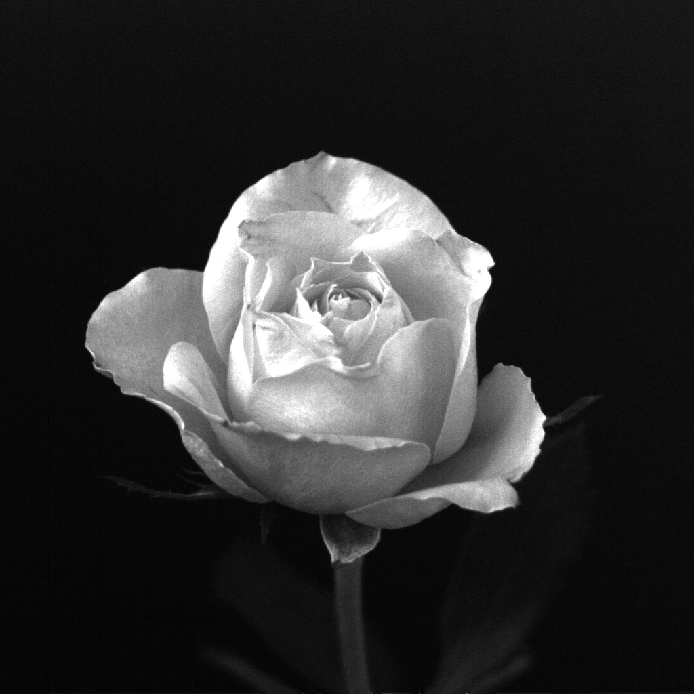

**对比度**：一幅图像中最高与最低灰度级间的灰度差

存储数字图像所需的比特数b为

$$
b = M * N * k
$$
 $`k=8`$ 时称为8比特图像，即灰度级范围为 $`[0,2^k-1]`$ 

### 2.4.3 空间和灰度分辨率

* **空间分辨率** 单位距离的线对数和单位距离的点数（像素数），单位为 $`dpi`$ 直观上指图像中可分辨的最小细节的度量

* **灰度分辨率** 灰度级中可分辨的最小变化，单位为比特（即量化灰度的比特数）
  灰度级数不足会出现伪轮廓

```c++
// 例2.2 ----降低空间分辨率
	cv::Mat img, img1, img2, img3, img4, img5, img6, img7;
    img = cv::imread("images/Chapter2/chronometer.tif",0);
    if(img.empty()){
        return -1;
    }
    std::vector<cv::Mat> pyr;
    cv::buildPyramid(img,pyr,4); // 创建图像金字塔
    std::vector<std::string> str{"1","2","3","4","5"};
    int i = 0;
    for (cv::Mat m: pyr){
        //cv::imwrite(str[i] + ".jpg",pyr[i]);
        cv::imshow(str[i],m);
        i++;
    }
    cv::waitKey(0);
```

 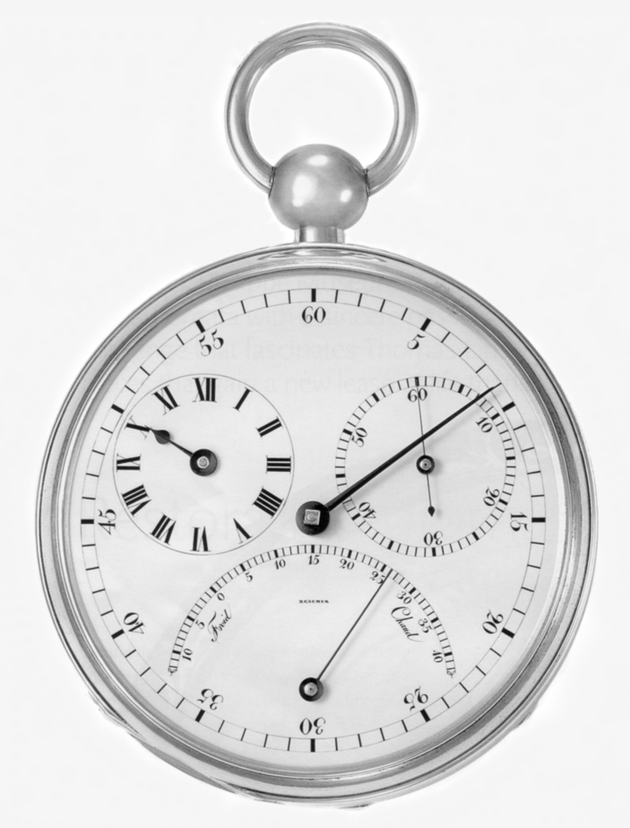

​                                       原图1250dpi                                                                                      大概300dpi

 

​                                      大概150dpi                                                                                           大概72dpi

```c++
// 例2.3 ----改变数字图像中的灰度级
	cv::Mat img, img1, img2, img3, img4, img5,img6,img7;
    img = cv::imread("images/Chapter2/ctskull.tif",0);
    if(img.empty()){
        return -1;
    }
    
    cv::normalize(img,img1,0,127,cv::NORM_MINMAX,-1);
    cv::normalize(img,img2,0,63,cv::NORM_MINMAX,-1);
    cv::normalize(img,img3,0,31,cv::NORM_MINMAX,-1);
    cv::normalize(img,img4,0,15,cv::NORM_MINMAX,-1);
    cv::normalize(img,img5,0,7,cv::NORM_MINMAX,-1);
    cv::normalize(img,img6,0,3,cv::NORM_MINMAX,-1);
    cv::normalize(img,img7,0,1,cv::NORM_MINMAX,-1);
    cv::normalize(img1,img1,0,255,cv::NORM_MINMAX,-1);
    cv::normalize(img2,img2,0,255,cv::NORM_MINMAX,-1);
    cv::normalize(img3,img3,0,255,cv::NORM_MINMAX,-1);
    cv::normalize(img4,img4,0,255,cv::NORM_MINMAX,-1);
    cv::normalize(img5,img5,0,255,cv::NORM_MINMAX,-1);
    cv::normalize(img6,img6,0,255,cv::NORM_MINMAX,-1);
    cv::normalize(img7,img7,0,255,cv::NORM_MINMAX,-1);
    cv::imshow("256",img);
    cv::imshow("128",img1);
    cv::imshow("64",img2);
    cv::imshow("32",img3);
    cv::imshow("16",img4);
    cv::imshow("8",img5);
    cv::imshow("4",img6);
    cv::imshow("2",img7);
    cv::waitKey(0);
    cv::destroyAllWindows();

    cv::imwrite("256.jpg",img);
    cv::imwrite("128.jpg",img1);
    cv::imwrite("64.jpg",img2);
    cv::imwrite("32.jpg",img3);
    cv::imwrite("16.jpg",img4);
    cv::imwrite("8.jpg",img5);
    cv::imwrite("4.jpg",img6);
    cv::imwrite("2.jpg",img7);
```

 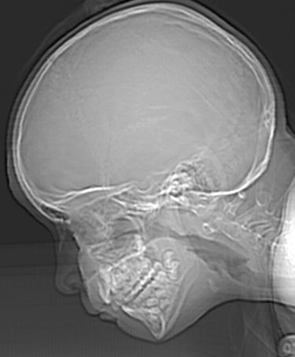   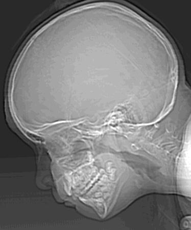

​					256                                   128                                            64                                         32

 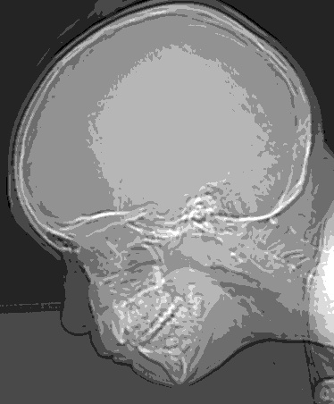 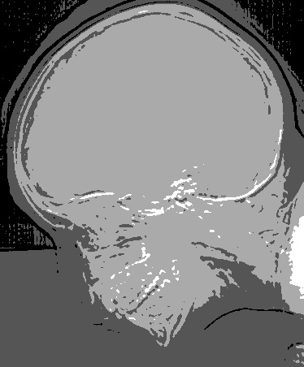 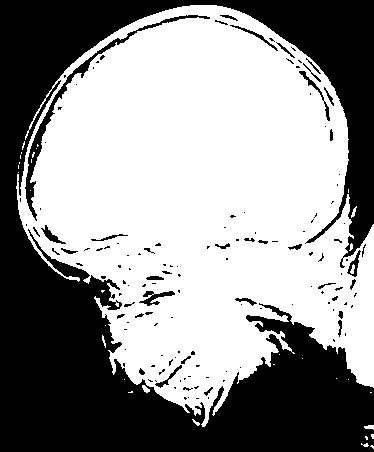

​                16                                                     8                                   4                                                 2

-----

**空间分辨率和灰度分辨率之间的关系**

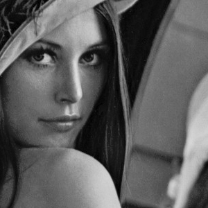 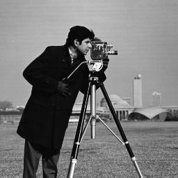  

​				具有少量细节(face)                                   具有中等细节(cameraman)                              具有大量细节(crowd)

>  通过改变 $`N`$ 和 $`k`$ ，生成这三种类型的一组图像，然后让人主观地对图像质量进行排序，最终绘制出等偏爱曲线

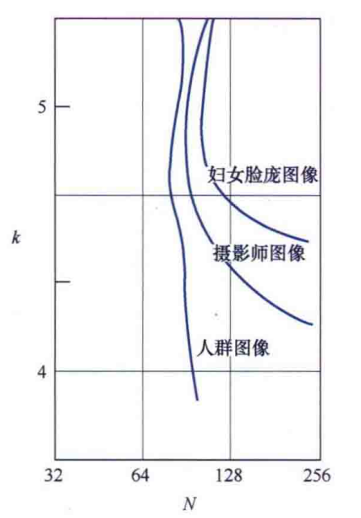

对于细节丰富的图像，可能只需要较少的灰度级


### 2.4.4 图像内插

**内插**是在诸如<u>放大、收缩、旋转和几何校正</u>等任务中广泛应用的基本工具

<u>本质上是用已知数据来估计未知位置的数值</u>

* 最近邻内插
e.g. $`500 \times 500 \rarr 750 \times 750`$ 假设 $`750 \times 750`$ 像素缩小到 $`500 \times 500`$ 像素的大小，对图片进行临近采样，再放大回去

​	**缺点** ：某些直边缘的严重失真 -- 不常用

------

* 双线性内插

​		用4个最临近的点去估计给定位置的灰度，其公式满足
$$
v(x,y) = ax + by + cxy + d
$$
​	速度较快，质量较好 -- 最常用

-----

* 双三次内插

​		用16个临近点去估计灰度值，其公式满足
$$
v(x,y) = \sum^3_{i = 0} \sum^3_{j = 0} a_{ij} x^i y^j
$$
​	能极大程度保留细节，但计算量大 -- PS的标准内插方式

算法的具体介绍参见[最近邻插值、双线性插值与双三次插值 - 知乎 (zhihu.com)](https://zhuanlan.zhihu.com/p/428523385)

```c++
// 例2.4 用于图像收缩和放大的内插方法的比较
    cv::Mat img, img1, img_n, img_n1, img_l, img_c, img_l1, img_c1, img_lan;
    img = cv::imread("./5.jpg",0);
    img1 = cv::imread("./4.jpg",0);
    if(img.empty() || img1.empty()){
        return -1;
    }
    cv::resize(img,img_n,img.size()*16,0.,0.,cv::INTER_NEAREST); // 最邻近内插
    cv::imwrite("72dpi_n.jpg",img_n);
    cv::imshow("72dpi_nearest",img_n);
    
    cv::resize(img,img_l,img.size()*16,0.,0.,cv::INTER_LINEAR); // 双线性内插
    cv::imwrite("72dpi_l.jpg",img_l);
    cv::imshow("72dpi_linear",img_l);

    cv::resize(img,img_c,img.size()*16,0.,0.,cv::INTER_CUBIC); // 双三次内插
    cv::imwrite("72dpi_c.jpg",img_c);
    cv::imshow("72dpi_cubic",img_c);

    cv::resize(img1,img_n1,img1.size()*8,0.,0.,cv::INTER_NEAREST);
    cv::imwrite("150dpi_n1.jpg",img_n1);
    cv::imshow("150dpi_nearest",img_n1);

    cv::resize(img1,img_l1,img1.size()*8,0.,0.,cv::INTER_LINEAR);
    cv::imwrite("150dpi_l1.jpg",img_l1);
    cv::imshow("150dpi_linear",img_l1);

    cv::resize(img1,img_c1,img1.size()*8,0.,0.,cv::INTER_CUBIC);
    cv::imwrite("150dpi_c1.jpg",img_c1);
    cv::imshow("150dpi_cubic",img_c1);

    cv::waitKey(0);
```

 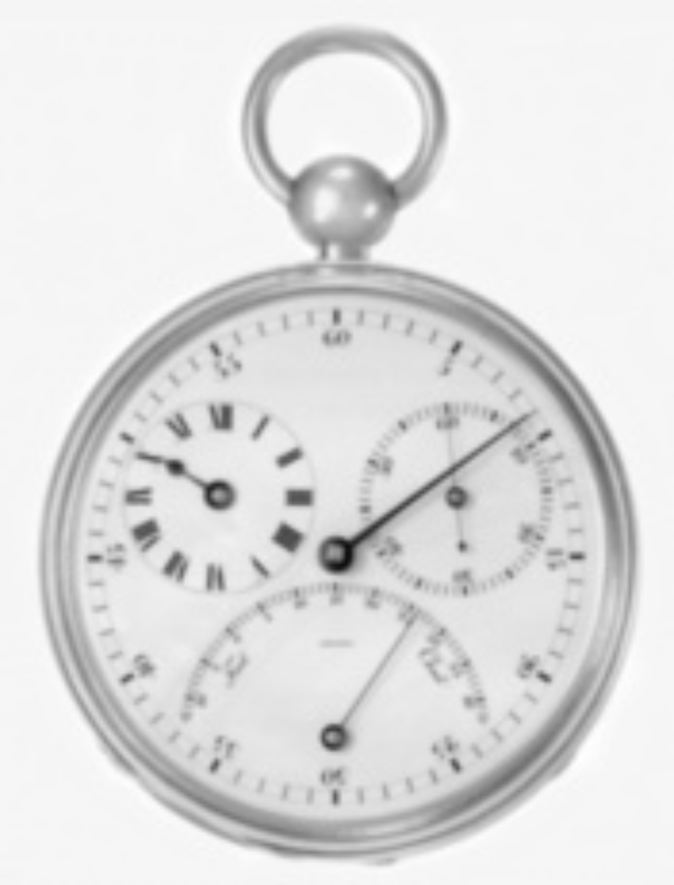  

​                72dpi 最邻近内插                                            72dpi 双线性内插                                 72dpi 双三次内插

  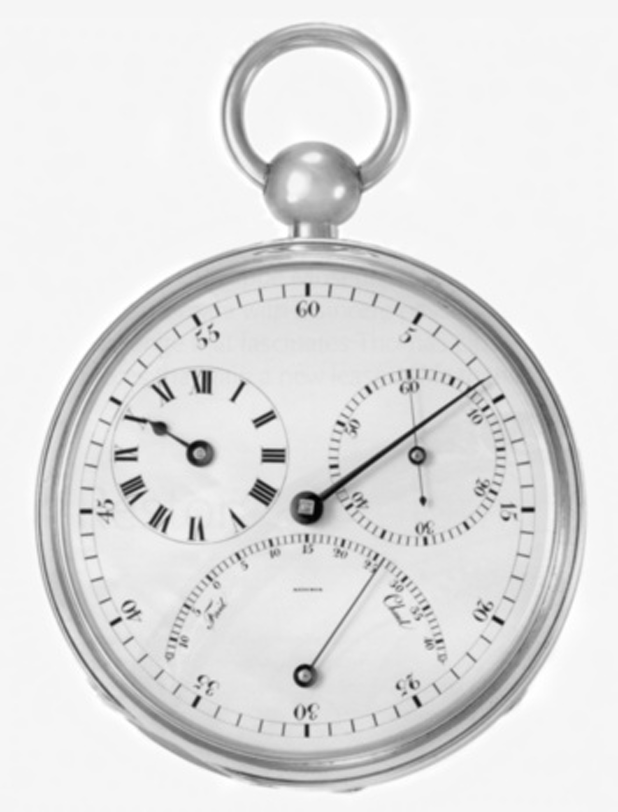 

​				150dpi 最邻近内插                                        150dpi 双线性内插                                150dpi 双三次内插

 <!--（《150dpi 最邻近内插》该图本应该是有大量锯齿边缘的，但在这份笔记里，缩小的太厉害了，看不出来）-->

<!--建议自行运行代码查看生成的图片-->

## 2.5 像素间的一些基本关系

### 2.5.1 相邻像素

位于坐标(x,y)处的像素p有4个水平和垂直的相邻像素，这一组像素称为p的4邻域

**4邻域**：$(x-1,y),(x+1,y),(x,y-1),(x,y+1)$，记为$N_4(p)$

**4对角邻域**：$(x+1,y+1),(x+1,y-1),(x-1,y-1),(x-1,y+1)$，记为$N_D(p)$

其上统称为**8邻域**，记为$N_8(p)$

### 2.5.2 邻接性、连通性、区域和边界

==？？？==

### 2.5.3 距离度量

$D_4(p,q) =|x-s|+|y-t|$,即一个菱形区域，当$`D_4=1`$时，即为4邻域
$D_8(p,q) =max(|x-s|,|y-t|)$,即一个菱形区域，当$`D_8=1`$时，即为8邻域

==？？？？？==

## 2.6 数字图像处理中所用数学工具的介绍

### 2.6.1 阵列与矩阵操作

阵列操作：类似Matlab中的 **.*    ./   .^**  

### 2.6.2 线性操作与非线性操作

线性操作：线性算子的运算 eg. 阵列求和

非线性操作：非线性算子的运算 eg. 寻找最大值

### 2.6.3 算术操作

算术操作是阵列操作

==待建设!!!!!!!!!!!==

* \+ 用途：相加取平均，可以对同一幅图像多次累加取平均，用来去除加性噪声 类似手机拍摄夜景
* \-  用途：增强图像差别
* x  用途：矫正阴影， 挑选出ROI
* /  用途：矫正阴影
矩阵相乘：矩阵运算

### 2.6.4 集合和逻辑操作

==待建设！！！！！==

$`A^c`$：表示补集
$`A=\{(x,y,x)\}`$，则$`A^c=\{(x,y,K-z)|(x,y,x)\in A \}`$

逻辑运算
同理……

模糊集合
隶属度函数
eg. 一个人的年轻度为50%

### 2.6.5 空间操作

* 单像素操作
    灰度变换
* 邻域操作
    模糊$`g(x,y)=1/mn*\sum_{(r,c)\in S_{xy}}f(r,c)`$
* 几何空间变换和图像配准
    几何变换：空间变换+灰度内插
    尺度，旋转，平移，偏移变换
    ……

    图像配准
    寻找约束点，建立两幅图像的空间变换关系式

* 图像变换
    在变换域处理图像，在反变换回去

### 2.6.6 向量与矩阵操作


### 2.6.7 图像变换


### 2.6.8 概率方法
